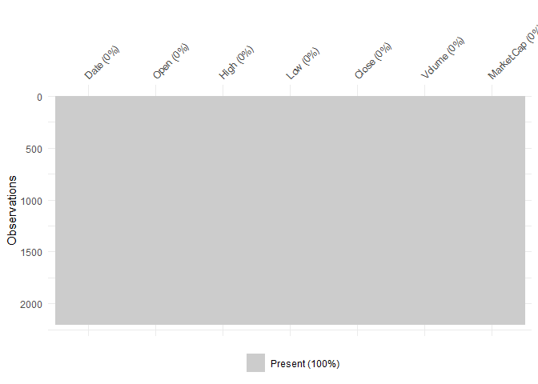
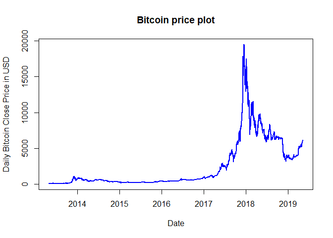
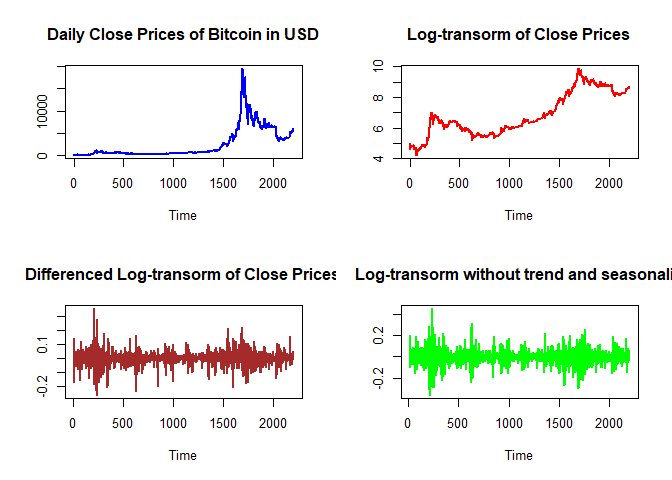
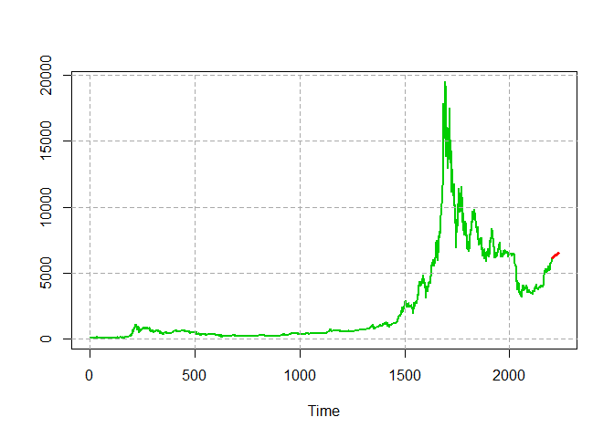
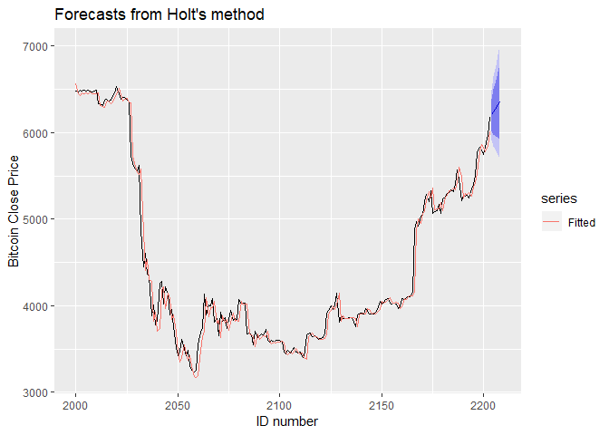
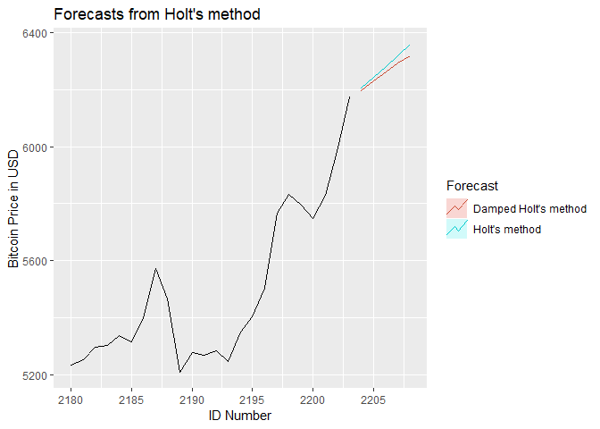
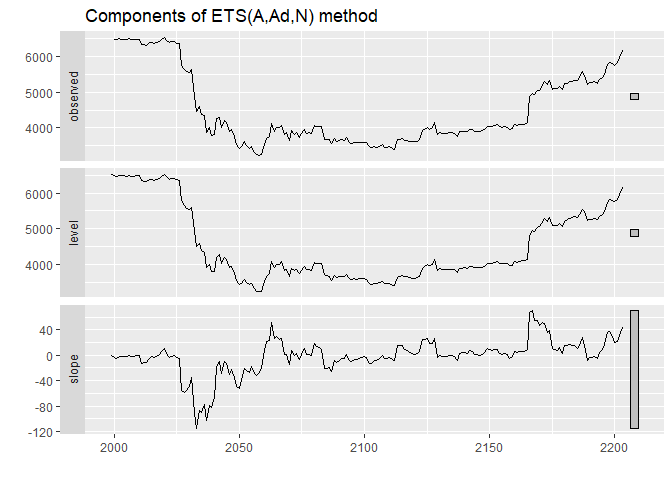
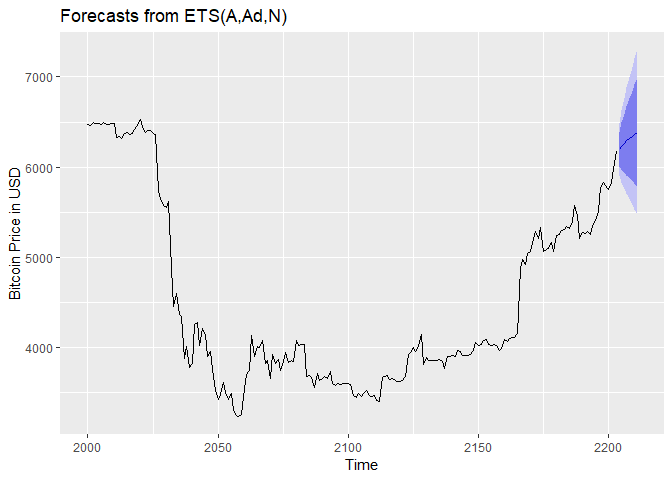

Bitcoin Price Forecasting
================
Keerthikant

##### The data we have considered is from Apr 23 2013 to May 9, 2019. I have extracted the data from the website (<https://coinmarketcap.com/>).

##### Forecast is a generic function for forecasting from time series or time series models. The function invokes particular methods which depend on the class of the first argument.

##### Naniar package is used to plot heatmap to check missing values in the data

##### Lubridate package is used for to work with dates and times

``` r
setwd('C:/Users/keert/Documents/Keerthi/Personal/ML/Time series/bitcoin/Code')
library(forecast)
library(ggplot2)
library(lubridate)
library(dplyr)
library(naniar)
library(tseries)
```

##### Let's load the input file which is the training file provided in the bitcoin dataset.

``` r
train_data=read.csv('C:/Users/keert/Documents/Keerthi/Personal/ML/Time series/bitcoin/Data/Bitcoin_Train_Data.csv',header=TRUE)
test_data=read.csv('C:/Users/keert/Documents/Keerthi/Personal/ML/Time series/bitcoin/Data/Bitcoin_Test_Data.csv',header=TRUE)
```

##### Initial checks to convert date field so that we can work on time series models.

``` r
str(train_data)
```

    ## 'data.frame':    2203 obs. of  7 variables:
    ##  $ Date      : Factor w/ 2203 levels "1/1/2014","1/1/2015",..: 1214 1221 1234 1277 1344 1411 1430 1437 1444 1451 ...
    ##  $ Open      : num  135 134 144 139 116 ...
    ##  $ High      : num  136 147 147 140 126 ...
    ##  $ Low       : num  132.1 134 134.1 107.7 92.3 ...
    ##  $ Close     : num  134 145 139 117 105 ...
    ##  $ Volume    : Factor w/ 1961 levels "-","10004800",..: 1 1 1 1 1 1 1 1 1 1 ...
    ##  $ Market.Cap: num  1.49e+09 1.60e+09 1.54e+09 1.30e+09 1.17e+09 ...

``` r
train_data$Date <- mdy(train_data$Date)
test_data$Date <- mdy(test_data$Date)

train_data$Volume = gsub('-','0',train_data$Volume)
train_data$Volume = as.numeric(train_data$Volume)
```

##### Initial summaries to see any outliers in any of the columns

``` r
head(train_data)
```

    ##         Date   Open   High    Low  Close Volume Market.Cap
    ## 1 2013-04-28 135.30 135.98 132.10 134.21      0 1488566728
    ## 2 2013-04-29 134.44 147.49 134.00 144.54      0 1603768865
    ## 3 2013-04-30 144.00 146.93 134.05 139.00      0 1542813125
    ## 4 2013-05-01 139.00 139.89 107.72 116.99      0 1298954594
    ## 5 2013-05-02 116.38 125.60  92.28 105.21      0 1168517495
    ## 6 2013-05-03 106.25 108.13  79.10  97.75      0 1085995169

``` r
summary(train_data)
```

    ##       Date                 Open              High         
    ##  Min.   :2013-04-28   Min.   :   68.5   Min.   :   74.56  
    ##  1st Qu.:2014-10-30   1st Qu.:  346.2   1st Qu.:  353.84  
    ##  Median :2016-05-03   Median :  629.4   Median :  641.28  
    ##  Mean   :2016-05-03   Mean   : 2421.0   Mean   : 2490.77  
    ##  3rd Qu.:2017-11-04   3rd Qu.: 3879.4   3rd Qu.: 3949.62  
    ##  Max.   :2019-05-09   Max.   :19475.8   Max.   :20089.00  
    ##       Low               Close              Volume         
    ##  Min.   :   65.53   Min.   :   68.43   Min.   :0.000e+00  
    ##  1st Qu.:  338.59   1st Qu.:  346.81   1st Qu.:1.989e+07  
    ##  Median :  618.50   Median :  629.15   Median :6.808e+07  
    ##  Mean   : 2344.47   Mean   : 2423.62   Mean   :1.993e+09  
    ##  3rd Qu.: 3802.11   3rd Qu.: 3883.70   3rd Qu.:3.131e+09  
    ##  Max.   :18974.10   Max.   :19497.40   Max.   :2.384e+10  
    ##    Market.Cap       
    ##  Min.   :7.784e+08  
    ##  1st Qu.:4.796e+09  
    ##  Median :9.235e+09  
    ##  Mean   :4.041e+10  
    ##  3rd Qu.:6.749e+10  
    ##  Max.   :3.265e+11

##### Plotting heatmap to check for missing data

``` r
#Heat map to check any missing data
vis_miss(train_data)
```



-   The data is clean. There are no missing element. There is nothing unusual about the data.

##### We plot the initial bitcoin close price for each day from Apr 2013 to May 2019.

``` r
plot(train_data$Close~train_data$Date,xlab='Date',ylab ='Daily Bitcoin Close Price in USD',
     main='Bitcoin price plot', type='l',lwd=2,col='blue')
```



### We proceed with next steps to make the data stationary to apply time series models -

-   astsa package is used for applied stastical time series models
-   Creating timeseries data using ts()

``` r
library(astsa)

bit_train<-ts(train_data$Close)
bit_test<-ts(test_data$Close)
```

``` r
par(mfrow=c(2,2))

plot(bit_train, main='Daily Close Prices of Bitcoin in USD', ylab='', col='blue', lwd=2)
plot(log(bit_train), main='Log-transorm of Close Prices', ylab='', col='red', lwd=2)
plot(diff(log(bit_train)), main='Differenced Log-transorm of Close Prices', ylab='', col='brown', lwd=2)
plot(diff(diff(log(bit_train)),12), main='Log-transorm without trend and seasonaliy', ylab='', col='green', lwd=2)
```



-   We notice that our data is non-stationary, we apply log-return method to make it stationary.
-   Log return is achieved by diff(log())
-   We plot 4 graphs in efforts to see if log-return methods makes the data stationary before we apply AR or MA or ARMA or ARIMA models.

##### Performing Ljung-Box test for correlation

``` r
Box.test(diff(log(bit_train)), lag = log(length(diff(log(bit_train)))),type ='Ljung-Box')
```

    ## 
    ##  Box-Ljung test
    ## 
    ## data:  diff(log(bit_train))
    ## X-squared = 19.262, df = 7.6971, p-value = 0.01135

-   We can notice that p &lt; 0.05, there exists some correlation with the close price of the bitcoin

##### We perform dickey-fuller test to determine stationary in the data

``` r
adf.test(diff(log(bit_train)), alternative="stationary", k=0)
```

    ## Warning in adf.test(diff(log(bit_train)), alternative = "stationary", k =
    ## 0): p-value smaller than printed p-value

    ## 
    ##  Augmented Dickey-Fuller Test
    ## 
    ## data:  diff(log(bit_train))
    ## Dickey-Fuller = -46.741, Lag order = 0, p-value = 0.01
    ## alternative hypothesis: stationary

-   We can conclude that there is no stationarity from above p-value

##### Auto Correlation Function (ACF) and Partial Auto Correlation Function (PACF) of the differenced data is observed to get the p,d,q values.

``` r
par(mfrow=c(1,2))
acf(diff(log(bit_train)), main='ACF of log differenced data', 100)
pacf(diff(log(bit_train)), main='PACF of log differenced data', 100)
```


##### We fit arima(4,1,3) model with seasonal component included in it, below plot shows the predictions

``` r
fit <- arima(log(bit_train), c(4, 1, 3),seasonal = list(order = c(1, 1, 1), period = 3))
pred <- predict(fit, n.ahead = 10*3)
ts.plot(bit_train,2.718^pred$pred, lty = c(1,5),col=c(3,2),lwd=c(2,3))
grid(nx = NULL, ny = NULL, col = "darkgray", lty = 2,lwd = par("lwd"), equilogs = TRUE)
```



-   We have also used auto.arima() to check the p,d,q which complements the ACF and PACF graphs

### We now proceed with Exponential Smoothing Methods

##### 1. Simple Exponential Smoothing

##### 2. Holt's Linear Trend Method

##### 3. Damped Holt's Method

-   We have reduced the window size for the time series to start from observation number= 2000 for graph plotting purposes.

##### We notice that AIC is 3122 and MAPE=2.009 for Simple Exponential Smoothing

``` r
close_ses <- ses(window(bit_train,start=2000),h=5)
summary(close_ses)
```

    ## 
    ## Forecast method: Simple exponential smoothing
    ## 
    ## Model Information:
    ## Simple exponential smoothing 
    ## 
    ## Call:
    ##  ses(y = window(bit_train, start = 2000), h = 5) 
    ## 
    ##   Smoothing parameters:
    ##     alpha = 0.9948 
    ## 
    ##   Initial states:
    ##     l = 6476.3853 
    ## 
    ##   sigma:  146.2404
    ## 
    ##      AIC     AICc      BIC 
    ## 3122.869 3122.989 3132.824 
    ## 
    ## Error measures:
    ##                    ME     RMSE      MAE         MPE     MAPE      MASE
    ## Training set -1.49238 145.5218 86.47161 -0.07900579 2.009397 0.9946959
    ##                      ACF1
    ## Training set -0.000699998
    ## 
    ## Forecasts:
    ##      Point Forecast    Lo 80    Hi 80    Lo 95    Hi 95
    ## 2204       6173.525 5986.111 6360.940 5886.900 6460.151
    ## 2205       6173.525 5909.170 6437.881 5769.229 6577.822
    ## 2206       6173.525 5850.040 6497.011 5678.797 6668.254
    ## 2207       6173.525 5800.159 6546.892 5602.511 6744.540
    ## 2208       6173.525 5756.199 6590.852 5535.279 6811.772

``` r
autoplot(close_ses) +
  autolayer(fitted(close_ses), series="Fitted") +
  ylab("Bitcoin Close Price") + xlab("ID number")
```


##### We notice that AIC is 3123 and MAPE=2.024 for Holt's method

``` r
close_holt<-holt(window(bit_train,start=2000),h=5)

summary(close_holt)
```

    ## 
    ## Forecast method: Holt's method
    ## 
    ## Model Information:
    ## Holt's method 
    ## 
    ## Call:
    ##  holt(y = window(bit_train, start = 2000), h = 5) 
    ## 
    ##   Smoothing parameters:
    ##     alpha = 0.95 
    ##     beta  = 0.0302 
    ## 
    ##   Initial states:
    ##     l = 6596.5756 
    ##     b = -30.0643 
    ## 
    ##   sigma:  145.8238
    ## 
    ##      AIC     AICc      BIC 
    ## 3123.676 3123.979 3140.266 
    ## 
    ## Error measures:
    ##                    ME     RMSE      MAE       MPE     MAPE     MASE
    ## Training set 11.07994 144.3871 87.51121 0.2582899 2.024862 1.006655
    ##                      ACF1
    ## Training set -0.006579805
    ## 
    ## Forecasts:
    ##      Point Forecast    Lo 80    Hi 80    Lo 95    Hi 95
    ## 2204       6204.507 6017.626 6391.388 5918.697 6490.316
    ## 2205       6242.734 5981.041 6504.426 5842.510 6642.958
    ## 2206       6280.961 5958.250 6603.672 5787.417 6774.504
    ## 2207       6319.188 5942.405 6695.971 5742.947 6895.428
    ## 2208       6357.415 5930.780 6784.050 5704.933 7009.897

``` r
autoplot(close_holt) +
  autolayer(fitted(close_holt), series="Fitted") +
  ylab("Bitcoin Close Price") + xlab("ID number")
```



##### We notice that AIC is 3121 and MAPE=1.9867 for Damped Holt's method. This has the lowest MAPE as compared to above methods.

``` r
close_holt_damp<-holt(window(bit_train,start=2000),h=5,damped = TRUE,phi=0.9)

summary(close_holt_damp)
```

    ## 
    ## Forecast method: Damped Holt's method
    ## 
    ## Model Information:
    ## Damped Holt's method 
    ## 
    ## Call:
    ##  holt(y = window(bit_train, start = 2000), h = 5, damped = TRUE,  
    ## 
    ##  Call:
    ##      phi = 0.9) 
    ## 
    ##   Smoothing parameters:
    ##     alpha = 0.8922 
    ##     beta  = 0.0863 
    ##     phi   = 0.9 
    ## 
    ##   Initial states:
    ##     l = 6487.7257 
    ##     b = 0.0417 
    ## 
    ##   sigma:  145.5593
    ## 
    ##      AIC     AICc      BIC 
    ## 3121.912 3122.215 3138.503 
    ## 
    ## Error measures:
    ##                     ME     RMSE      MAE         MPE     MAPE      MASE
    ## Training set 0.1905004 143.7644 85.50589 -0.01884714 1.986799 0.9835871
    ##                     ACF1
    ## Training set 0.002719271
    ## 
    ## Forecasts:
    ##      Point Forecast    Lo 80    Hi 80    Lo 95    Hi 95
    ## 2204       6195.081 6008.539 6381.623 5909.790 6480.372
    ## 2205       6230.869 5971.000 6490.738 5833.434 6628.304
    ## 2206       6263.078 5938.803 6587.354 5767.141 6759.015
    ## 2207       6292.067 5908.050 6676.083 5704.765 6879.369
    ## 2208       6318.156 5877.430 6758.882 5644.124 6992.188

``` r
autoplot(close_holt_damp) +
  autolayer(fitted(close_holt_damp), series="Fitted") +
  ylab("Bitcoin Close Price") + xlab("ID number")
```


##### Plotting in Holt's linear method forecasts and Damped Holt's method forecasts in single graph.

``` r
autoplot(window(bit_train,start=2180)) +
  autolayer(close_holt, series="Holt's method", PI=FALSE) +
  autolayer(close_holt_damp, series="Damped Holt's method", PI=FALSE) +
  ggtitle("Forecasts from Holt's method") + xlab("ID Number") +
  ylab("Bitcoin Price in USD") +
  guides(colour=guide_legend(title="Forecast"))
```



### We now proceed to next stage: determing the model parameters using ets() E= Error, T=Trend, S=Seasonal

``` r
bit_train_2000 <- window(bit_train, start=2000)
model_param <- ets(bit_train_2000,model="ZZZ",damped = TRUE)
summary(model_param)
```

    ## ETS(A,Ad,N) 
    ## 
    ## Call:
    ##  ets(y = bit_train_2000, model = "ZZZ", damped = TRUE) 
    ## 
    ##   Smoothing parameters:
    ##     alpha = 0.8953 
    ##     beta  = 0.0825 
    ##     phi   = 0.9073 
    ## 
    ##   Initial states:
    ##     l = 6529.5518 
    ##     b = 0.2486 
    ## 
    ##   sigma:  145.6052
    ## 
    ##      AIC     AICc      BIC 
    ## 3124.041 3124.467 3143.950 
    ## 
    ## Training set error measures:
    ##                     ME     RMSE     MAE         MPE     MAPE      MASE
    ## Training set 0.1399551 143.8098 85.7281 -0.01817569 1.990344 0.9861432
    ##                     ACF1
    ## Training set 0.002625989

-   We see alpha=0.895, beta=0.0825, phi=0.9073
-   The small values of beta mean that the slope and seasonal components change very little over time. The narrow prediction intervals indicate that the series is relatively easy to forecast due to the strong trend and seasonality.

``` r
autoplot(model_param)
```



``` r
model_param %>% forecast(h=8) %>%
  autoplot() +
  ylab("Bitcoin Price in USD")
```


